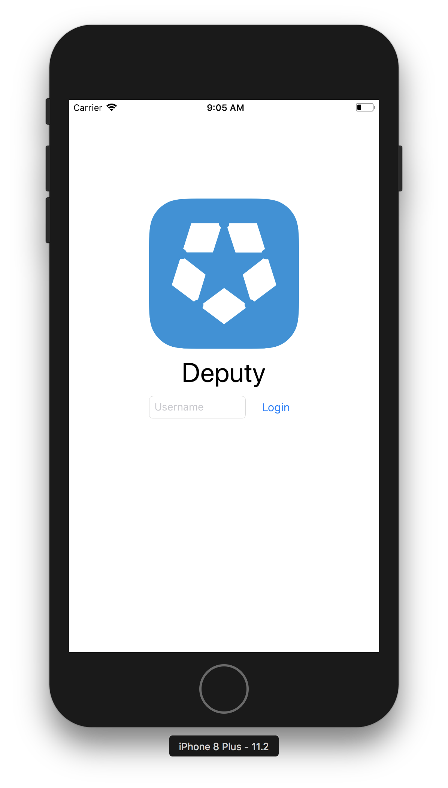
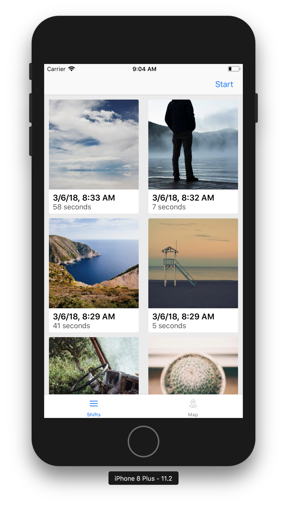
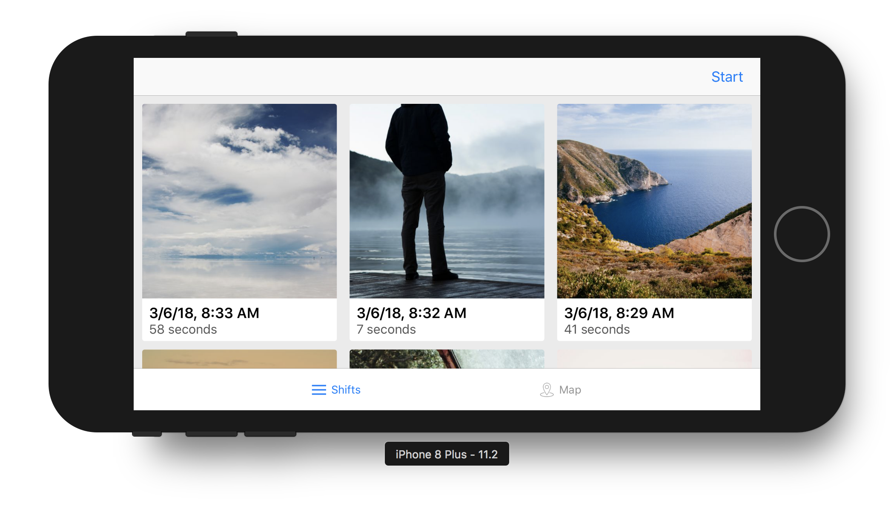
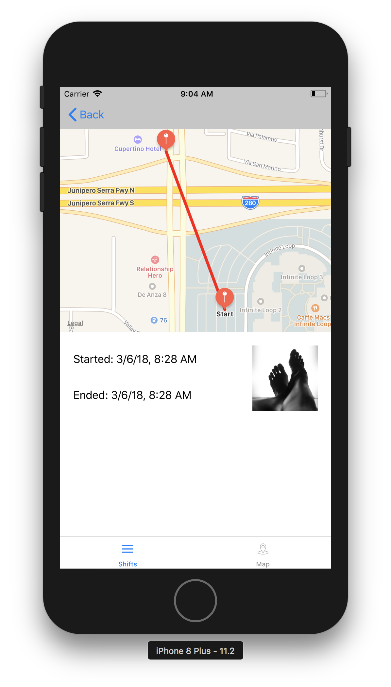
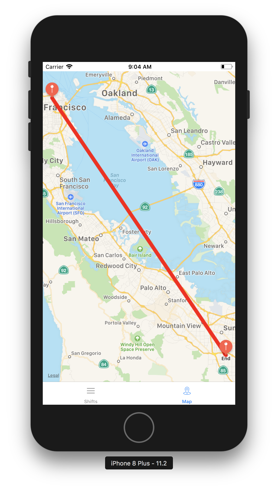

# Shift Tracker iOS App

## Features:

* Sart and end a shift with location from location service
* See current shift in progress
* Map with all shifts
* **Offline Mode**
* 2 or 3 column based on orientation(size class)
* Use of Swift 4 Codable for JSON parsing in models
* Unit tests for network layer

## Third part libraries used:

* Alamofire: type safe api call routing
* CryptoSwift: calculating sha1 for authentication
* Kingfisher: downloading and caching images
* Cache: offline storage using Codable

## Challanges faced:

* Endpoints are not REST-ful.
	* when no shifts are available `/shifts` should return and empty array instead of `null` string.
	* `/shift/start` and `/shift/end` should return empty response or proper http response codes
	* backend should ALWAYS return proper content type. It should not say content type is json when its returning string.
	* It shuld atleast do data type validation. During start and end shift, it accepts any type of data. It should atleast be consistant.
* Due to the way NSURLSession and system caching works, making multiple calls to the same image url results in a single image even though different calls to the image url should yield differnt image. Had to find an acceptable workaround

## Possible Improvements:

* Needs more unit tests
* Master detail using splitview
* Spereate ViewModel so that presentation logic is testable
* Use reactive programming techniques to do databinding and write declarative logic
* UI/UX can be improved

## Screenshots

### Login

### List

### List landscape

### Detail

### Map
